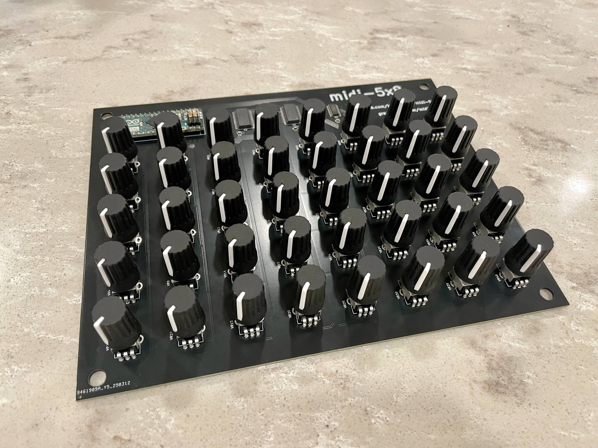
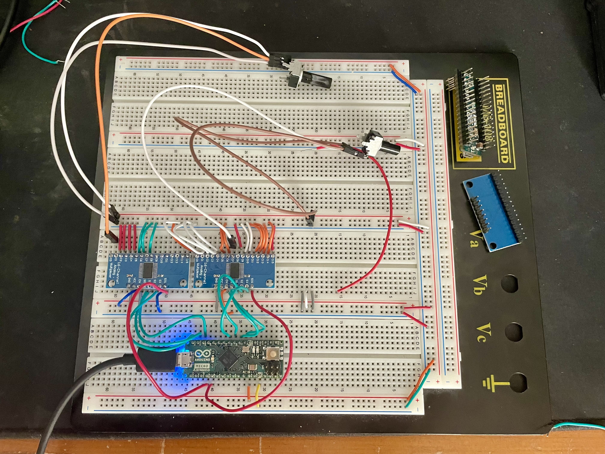
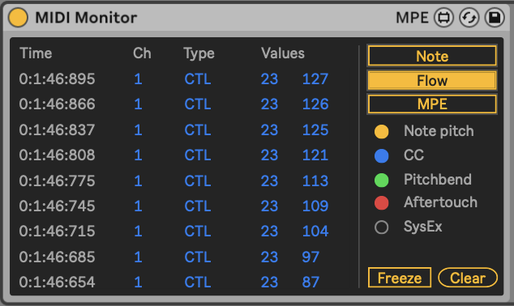
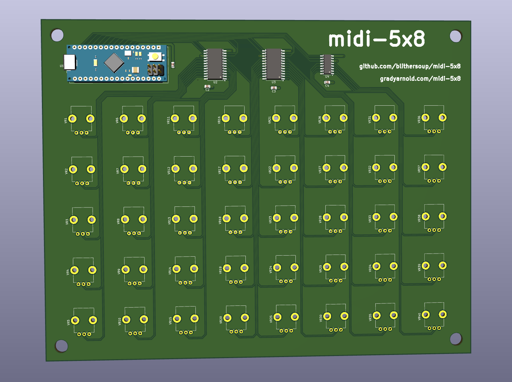
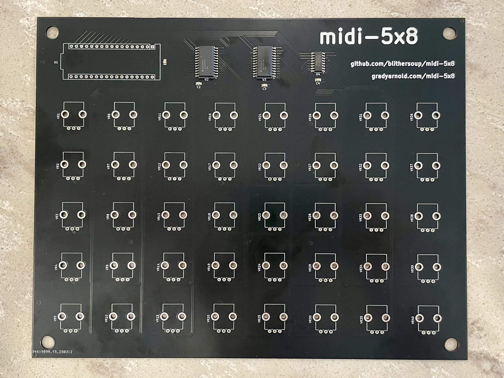
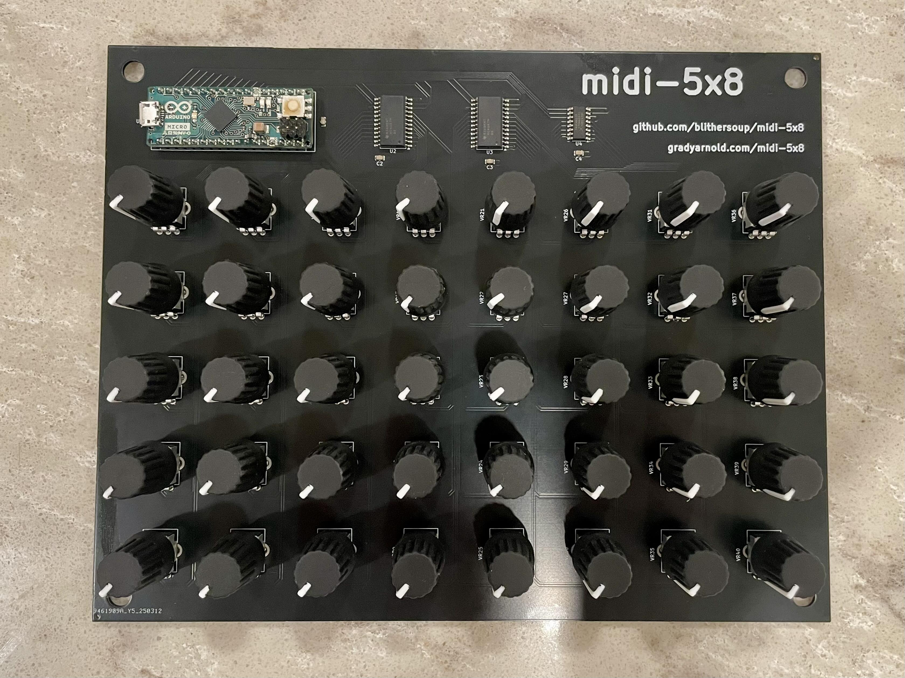
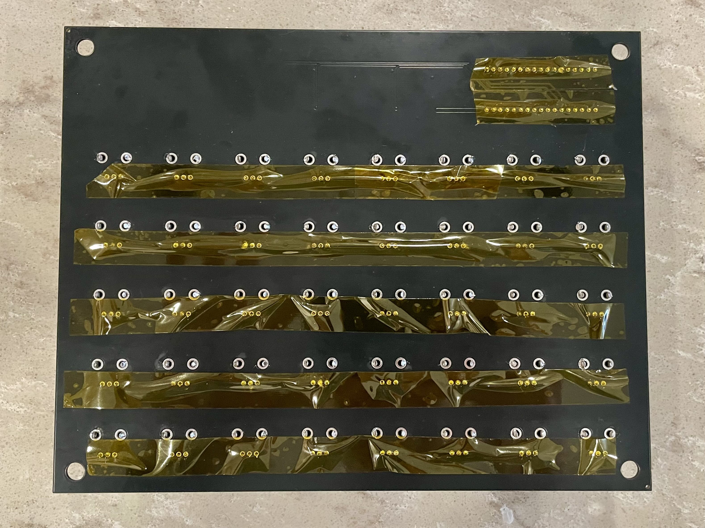

# midi-5x8

I have been trying to produce music recently and envisioned a workflow 
where I program midi notes ahead of time, then use an ableton controller 
and knob board to trigger midi clips and adjust parameters live.  I first 
purchased the Akai APC mini mk2 as the controller, but was not able to 
find a knob board that I wanted.  So, I made my own.

### Final product

I originally wrote this as a log of making design considerations for 
manufacturing a consumer product but ultimately decided that it was too 
much of a hassle; below is an explanation of the final design.

## Firmware

I am using the [Control Surface](https://github.com/tttapa/Control-Surface) 
library for the firmware, which provides everything I need for this project, 
from abstractions of midi elements to preprocessing of the analog signal.

> [Firmware source](src/firmware.ino)

## Hardware

I decided to use the Arduino Micro (not ideal) with 2x16 + 1x8 multiplexers 
to 40 Bourns PTV09 potentiometers.  With the number of potentiometers I have, 
I decided to wire the mux selection signals to 4+4+3 output GPIO pins.  I also 
could have shared the mux selection and expanded the enable signals or used a shift 
register.  The PCB was harder than I thought to make, but I think it turned out 
well.  I decided to use surface mount for the multiplexers and decoupling 
capacitors and pay for assembly for that.  Then I used through mounted potentiometers, 
so I needed to solder those and the microcontroller to the board.

### Schematic

Making the schematic was a lot easier when I learned about signal labels in KiCad; 
I think the final version is pretty clean.  I also had to reorder the wiring in a 
different way than I expected because of the way the IC pinout faced my potentiometer 
array.

> [Schematic](schematic/schematic.pdf)

### Final Hardware Prototype

### Testing on the DAW

Fortunately I only work with a DAW and my controller does not register MIDI 
control change signals.  So, my workflow will just be mapping knobs to parameters 
inside the DAW.  Because of this it does not matter what the control change signal is, 
as long as there is a unique value for each knob.  I have given them midi message 0-39 in 
column first order, same as their labeling on the schematic.

### PCB Model

> (see [schematics](schematic))

## Bill of Materials

| Part name                                                     | Quantity  |
|---------------------------------------------------------------|-----------|
| Bourns PTV09A-4020F-B103                                      | 40        |
| Tayda Electronics Black Rubber Knob 15x20mm D Shaft 6x4.5mm   | 40        |
| Arduino Micro                                                 | 1         |
| TI CD74HC4067M96 16-Channel Analog Multiplexer                | 2         |
| TI 74HC4051 8-Channel Analog Multiplexer                      | 1         |
| 100 nF Capacitor                                              | 4         |

## Takeaways

I just wanted the board so I used the arduino firmware solution, BUT if I wanted 
to add more features I would have switched to and STM32.  At that point I would have 
included just the mcu in the spec and wired the usb interface myself, which I 
considered for this project and decided against.  Overall, I am pleased with the 
end result and had a good time learning about pcb design.  Demo coming soon!

